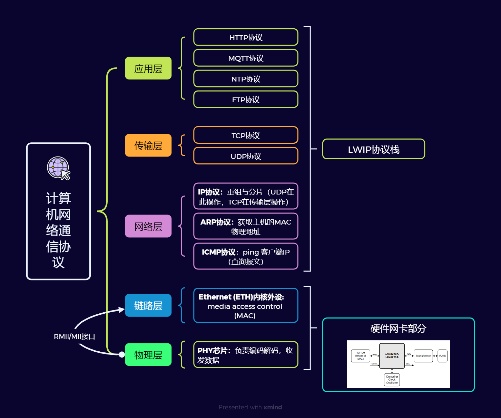

<h1 style="text-align: center;">四轴无人机项目</h1>

    本项目分为两个版本：永磁直流有刷电机版本（DC_Motor），与永磁直流无刷电机版本(BLDC)

# 项目框架目录简介

    Startup:MCU启动汇编文件

    APP ：应用层程序代码，包括无人机控制算法与工作流程的逻辑代码

    Driver(驱动层项目代码文件):
        -Dev_Driver:设备驱动代码，例如:姿态角度传感器MPU6050的驱动程序，温湿度传感器AHT10的驱动程序等等。
        -Peripheral_Driver:内核外设驱动/通信协议驱动（例如：SPI,PWM,UART,IIC等等）也包括模拟IIC,SPI等协议驱动

    Project: 集成开发环境工程项目文件
        -keil：keil IDE的工程项目文件

# 项目开发流程管理方法
    1. 模块化编程，模块化开发
    
    2. 开发完一个小功能模块，就进行全方位的功能性测试，以免将每个小模块都开发完了也不测试BUG，后续将多个小模块整合成一个大模块的时候，每个小模块都有BUG最后导致整个系统漏洞百出，到时候再找BUG就很困难了，何况就算你每个小模块的功能测试没问题，将多个小模块组成个大模块的时候也会有一大堆的BUG！！

# 系统设计方案
