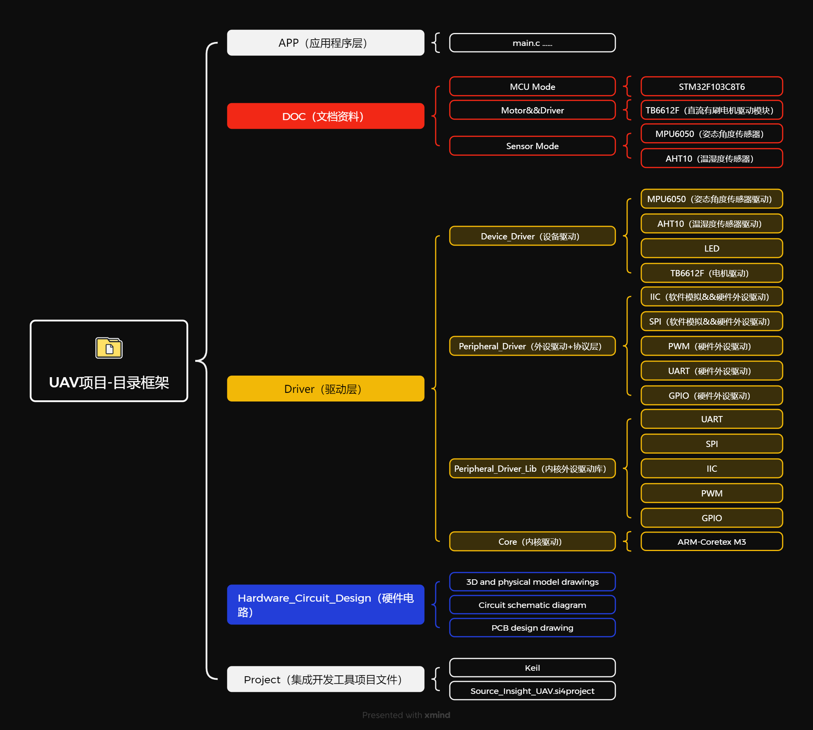
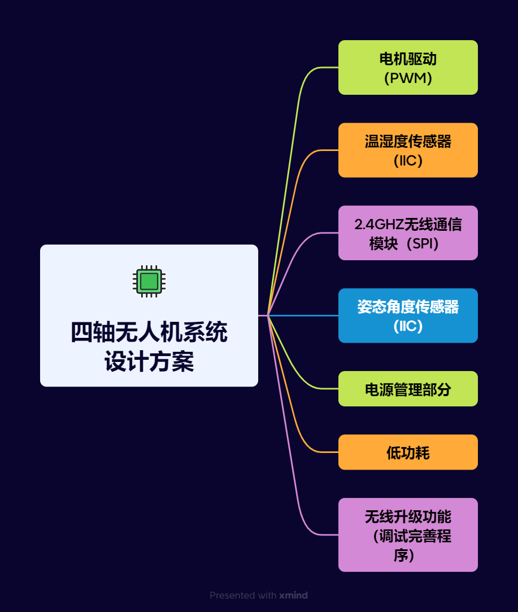

<h1 style="text-align: center;">四轴无人机项目</h1>

    本无人机项目分为两个版本：永磁直流有刷电机版与永磁直流无刷电机版本

# 系统硬件设计方案
****待定

# 系统软件设计方案
****待定

# 系统工作流程
****待定

# 项目框架目录简介

+ APP ：应用层程序代码，包括无人机控制算法与工作流程的逻辑代码

+ Doc: 相关文档资料

+ Driver：驱动层项目代码文件（包含内核驱动，外设驱动，协议驱动，设备驱动）
   
+ Hardware_Circuit_Design：硬件电路设计部分文件

+ Project: 集成开发环境工程项目文件

+ del_file.bat：删除Project\keil\Objects文件下编译生成的过程文件

+ Four-rotor_drone.code-workspace: vscode工作区文件

# 项目开发流程管理方法
1. 模块化编程，模块化开发
    
2. 开发完一个小功能模块，就进行全方位的功能性测试，以免将每个小模块都开发完了也不测试BUG，后续将多个小模块整合成一个大模块的时候，每个小模块都有BUG最后导致整个系统漏洞百出，到时候再找BUG就很困难了，何况就算你每个小模块的功能测试没问题，将多个小模块组成个大模块的时候也会有一大堆的BUG！！

# 系统设计方案
